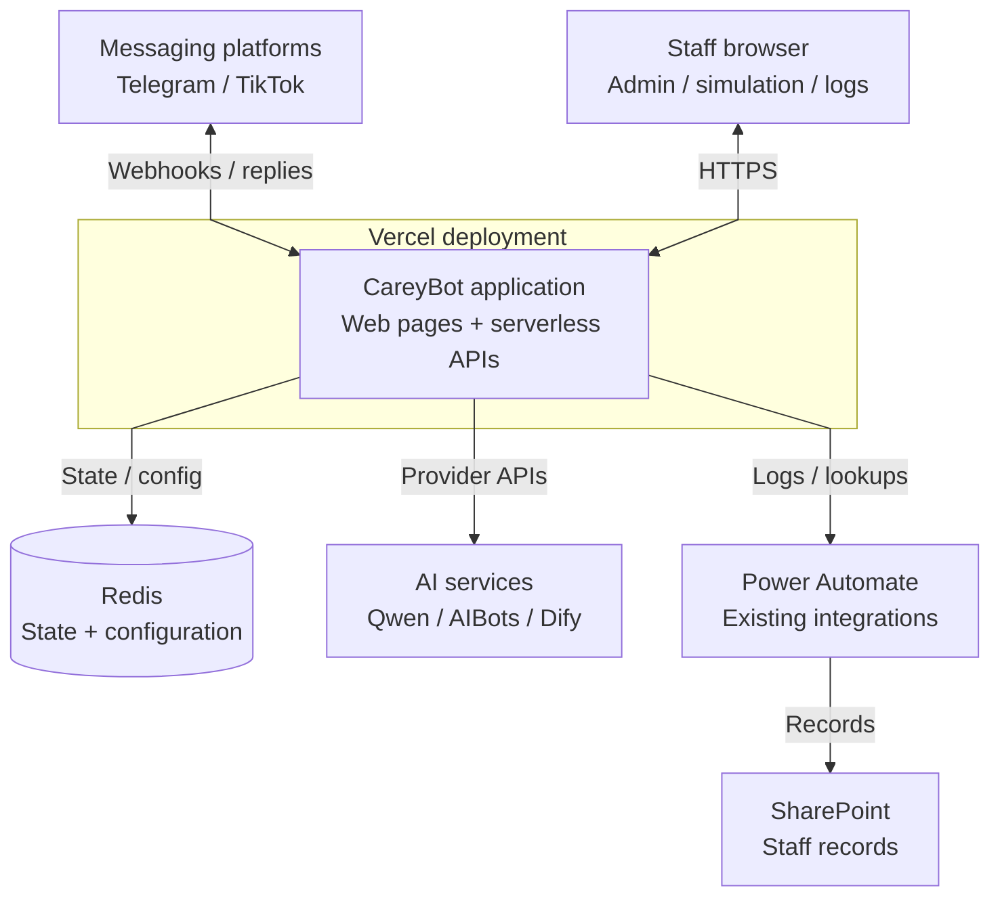
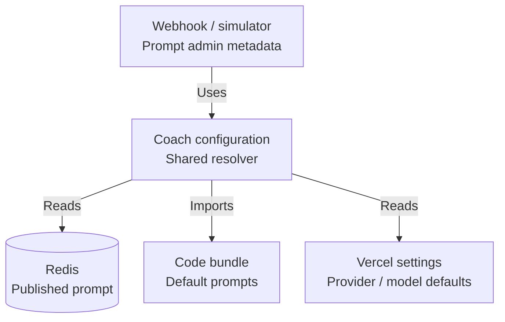
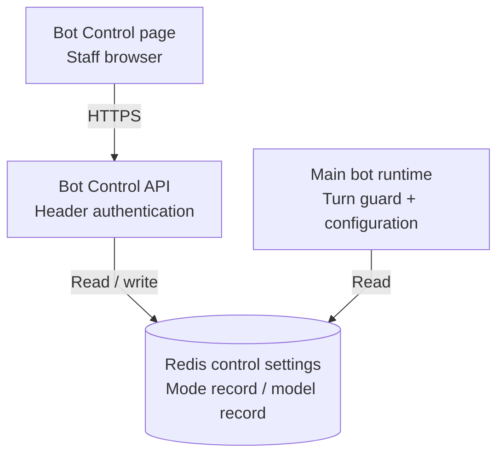
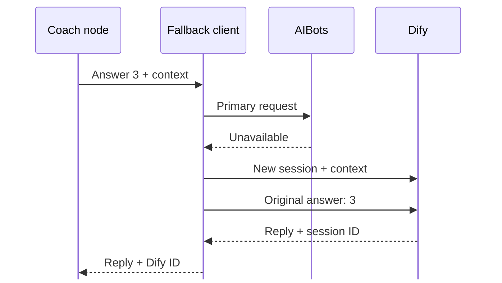

# CareyChats — architecture and implementation

Implemented locally on 13 September 2026, on branch `codex/careychats-comment-fixes`, based on upstream `8bffffc` (including the updated greeting).

Status: implementation and automated checks complete for an authorised branch push and preview deployment check. **Production promotion and live-prompt publication are not part of this release candidate.** Deployment acceptance must be checked against the pushed commit; this document does not certify production configuration. Diagrams are collected at the end.

## 1. What changed and why

The central failure was a routing collision: a user's answer to the coach's numbered question could be treated as a global service selection, change the selected scenario, clear the provider session, and become `Hi` before reaching the model. That chain could explain ignored choices, repeated menus and new introductions from a single underlying bug. Historical screenshots do not establish which provider/prompt/configuration was active.

| Reported symptom | Implemented correction | Evidence |
|---|---|---|
| Numbered choice ignored or wrong topic opened | Interpret global choices only in the menu phase; accept all six pivot scenarios; local digits preserve scenario/session | Full-graph routing tests in both menu modes |
| Ordinary text unexpectedly changes scenario | TALK/SOCIAL no longer map to pivot scenario IDs; HUMAN is a separate referral outcome | Controlled classifier tests |
| Repeated introductions/context questions | Explicit one-turn selection marker; original message retained; recovery instructions do not restart the conversation | Real direct-client request assembly tests |
| Apparent forgetting during a handoff | Preserve history even when a prime is supplied; replay it when creating a provider conversation | Wrapper and real AIBots/Dify request tests with mock transport |
| Conflicting intro/menu behaviour | Separate pivot prompt with platform-owned flow; unchanged study prompt | Prompt-selection tests and study source hash |
| Local test bot differs from live prompt path | Shared effective configuration for webhook and simulator; prompt source/version/hash metadata | Resolver tests and API typecheck |
| Bold appears as asterisks | Limited bold entities in the Telegram adapter, without enabling arbitrary markup | Transport tests including Unicode, literal markup and failure cases |
| Echoing, jargon and forced Singlish | Revised pivot language rules after deterministic fixes | Prompt checks only; generated-output UAT still required |

Two adjacent defects needed correction to make these routes work safely: referral age answers were never consumed, and several nodes entered the crisis phase before the static-first handler could recognise a first crisis turn. The static message text itself was not changed.

## 2. Ownership and boundaries

The transport adapter normalises incoming messages. The runner loads conversation state and appends the original user message. LangGraph owns intake, navigation, referral and crisis transitions. AI clients own only provider communication; the coach generates coaching content within that flow. The session persister appends the assistant reply and saves state before the webhook sends it.

| Component | Responsibility | Must not infer |
|---|---|---|
| Router/classifier | Determine whether this is navigation, a local reply, a referral or safety escalation | A local number is not an unsolicited global selection |
| Coaching node | Select an entry/handoff/recovery instruction and pass history plus the latest raw input | Missing provider ID does not mean new conversation |
| Fallback client | Preserve supplied context across provider transitions | A prime does not mean history is disposable |
| Prompt resolver | Choose the effective direct prompt and record its identity | A local override does not configure externally seeded providers |
| Telegram adapter | Render only supported bold ranges in plain text | Model output is not trusted HTML or general Markdown |

No new dependencies or general-purpose routing/rendering framework were added. Existing graph nodes and injected clients remain the main structure.

## 3. Answer binding and navigation

`conversationPhase` determines the meaning of a number:

- **Menu:** 1–6 select pivot scenarios; 1–3 select legacy triage services. Selection uses the raw whole message, so `1/2` and `-1` cannot become option 1 through punctuation stripping.
- **Active coaching:** a bare numeric reply is passed unchanged to the current coach. The latest question in history supplies its meaning. The deterministic tests prove delivery and state preservation, not that every model always interprets the choice correctly.
- **Pending referral age:** 1/yes and 2/no answer the age-band question. They do not select scenarios. A band is not fabricated into an exact stored age.

In pivot intent mode, natural-language turns still go through safety/referral classification, but TALK and SOCIAL cannot change the selected scenario. HUMAN routes to the deterministic referral node. In numbered mode, the existing coach referral tag remains the human-handoff mechanism. Crisis phrase detection precedes both modes.

`menu`, `back` and the existing navigation synonyms return to the menu; choosing a scenario there deliberately changes topics. Restart clears transient selection, handoff and referral state and reuses the current product's welcome source instead of maintaining a second stale greeting.

Implementation: `src/nodes/router.ts`, `intentClassifierNode.ts`, `menuPresenter.ts`, `resourceRedirectNode.ts`, `restartNode.ts`, and `src/graph/graph.ts`.

## 4. Conversation entry versus provider sessions

`menuSelection?: boolean` is an additive one-turn state marker. The classifier sets it for an explicit initial selection, the graph carries it, and the destination node clears it. Old saved sessions without it are treated as having no explicit new selection. No database migration, backfill or Redis flush is required.

| Entry case | Instruction and context |
|---|---|
| Explicit pivot scenario selection | Scenario-specific prime, known age, relevant history; do not repeat answered questions |
| Legacy service selection | Selected service's entry context |
| Accepted or classified handoff | Existing handoff markers; create the correct provider session and continue the prior context |
| Ordinary continuation | Existing provider ID, history and original input; no opening prime |
| Recovery without a provider ID | Continuation/recovery prime, history and original input; no fresh introduction |

The current user message appears once as the current input, not as `Hi` and not duplicated at the end of history. Direct clients send system instructions, history and current input in order. AIBots/Dify clients prime a newly created server conversation with context, then send the current input; normal existing server conversations do not replay the transcript on every turn.

Backend failure can still fail a request: this change preserves context during supported recovery paths, not exactly-once processing under every network failure. Session expiry still follows the existing six-hour policy.

Implementation: `src/types/state.ts`, `src/nodes/socialCoachNode.ts`, `freeTextNode.ts`, and `src/services/fallbackAIClient.ts`.

## 5. Safety and referral transitions

Nodes signal `crisisDetected`; the emergency handler owns entry into `conversationPhase = crisis`. This preserves static-first behaviour for phrase matches, classifier labels, coach tags, legacy service tags and the study safety check. On the first static response, the old provider ID is cleared because it may belong to another bot; subsequent support uses retained history and the real latest message.

CRISIS takes precedence over REFERRAL. Referral links remain deterministic and based on known age or an explicit age-band answer. After referral, the existing scenario is retained; an initial-menu referral with no scenario returns to menu phase rather than leaving an unroutable state.

The existing safety-copy constant says clinical sign-off is pending. This implementation does not certify the wording, clinical effectiveness, staff response time or production safety. Those remain release/governance requirements.

## 6. Prompt configuration and future editing

`src/services/resolveCoachConfig.ts` is called by both webhook and simulator. The prompt admin also exposes effective metadata and the appropriate bundled text.

| Runtime situation | Effective prompt |
|---|---|
| Direct provider with a valid enabled published prompt | Published prompt from the existing store |
| Direct pivot without a usable published prompt | `src/config/growingWeCoachPrompt.ts`, version `growing-we-v2` |
| Direct triage/study defaults | Existing `src/config/socialCoachPrompt.ts`, unchanged |
| AIBots with Dify fallback | Externally seeded prompts; local overrides are not applied |

Metadata includes product variant, configured provider/model, source, version, exact SHA-256 prompt hash when locally known, and deployment commit SHA when available. The webhook records configuration metadata, UAT records carry it, and the authenticated simulator returns it. External prompt hashes/versions are explicitly unknown, not invented. Actual AIBots/Dify/direct session ownership remains separately available from the chat ID.

To update the coach:

1. Check the effective source. A published prompt can override the bundle even after a new code deployment.
2. For the bundled pivot, edit `src/config/growingWeCoachPrompt.ts`, update its version, review safety tags and run the checks below.
3. For an admin-published prompt, review and test the proposed text before an authorised publication. No prompt was published during this implementation.
4. For externally seeded providers, coordinate that provider's separate prompt update; this repository cannot verify an unseen seeded prompt.

For the platform introduction, edit the appropriate welcome in `src/config/questionnaire.ts` (pivot) or `src/nodes/ageCheckNode.ts` (triage). Restart now uses the same welcome path. Changing an intro does not require the AI to introduce itself again.

`SYS_PROMPT.md` retains historical design text and now identifies the runtime source. **Do not use `npm run gen:prompt` to update the coach**: that legacy generator writes the general bot's `careySystemPrompt.ts`. The study prompt source is protected by a byte-for-byte regression check in this change.

## 7. Telegram formatting contract

Balanced standalone `*bold*` and `**bold**` become plain text plus bold entity ranges. Other content stays text. This intentionally supports neither arbitrary HTML nor a full Markdown dialect. Unmatched/unsupported markers, literal arithmetic and URL path characters are preserved conservatively.

Offsets use JavaScript string lengths, matching Telegram's UTF-16 entity offsets. See the [official MessageEntity contract](https://core.telegram.org/bots/api#messageentity). No `parse_mode` is enabled, so HTML-looking text is not interpreted as HTML.

Only an explicit HTTP 400 entity-parse rejection permits one plain-text fallback. Ambiguous network failures, authentication failures, rate limits and unrelated API errors are not retried by this formatter. Message splitting and general delivery retries are outside this change.

## 8. Verification and outstanding release checks

Run from the repository root:

```sh
npm run build
npm run typecheck:api
npm run test:comments -- --silent
npm test -- --runInBand
git diff --check
```

Local evidence:

- Initial synthetic full-graph reproduction: 27 failed and 10 passed before the fixes.
- Application build and API-inclusive typecheck pass.
- The comments regression command passes **239 tests across 17 suites**, covering routing, entry, providers, prompts, formatting, restart, study flags and safety handlers.
- A clean temporary archive of upstream `8bffffc` had 28 passing / 11 failing suites, with 310 passing / 10 failing executed tests. The earlier checkout's baseline differed because the newer upstream greeting invalidated two additional old copy assertions.
- Final full suite: **33 passing / 10 failing suites; 403 passing / 9 failing executed tests**. Comparison with the clean upstream archive found no new failing assertions; the corrected restart test became green. Existing failures remain visible, not skipped or waived.

Remaining existing failures: six suites reference removed/renamed APIs or questionnaire exports; session-manager tests lack encryption configuration; whitelist tests expect an obsolete TTL; age-copy tests expect the previous greeting/Yes-No intake. This change does not rewrite unrelated tests just to produce a green dashboard.

All new behavioural tests use synthetic messages and mocked services. Tests exercise real graph/node logic and real client request construction where specified; they do not send production conversations to AI services.

Before release:

- Verify the actual deployment SHA, flags, provider/model and effective prompt source/hash. No local Vercel project link was available, and live configuration was not verified.
- Run at least three fresh synthetic conversations per scenario against the selected live model/prompt in an authorised preview environment. Review lost selections, repeated intros, already-answered questions, echoing, plain language and Singlish. Prompt-string tests cannot establish generation quality.
- Check bold, URLs and fallback presentation in a test Telegram chat; smoke-test the study endpoint and human/crisis handoffs.
- Resolve or explicitly review existing test failures and security/governance blockers before approving production use.
- Branch push and preview deployment verification were authorised on 13 September 2026. The repository credential was verified as `carecorner-insight`, with push access and matching configured commit identity. Check Vercel acceptance against the pushed commit; production promotion and live-prompt publication require separate approval.

## 9. Security review and rollback

The changed input boundaries, routing, prompt metadata and Telegram output were reviewed. The formatter emits only bold entities, new metadata excludes prompt bodies/credentials/user content, and existing simulator/admin token gates remain in place. No new endpoint, dependency, credential or externally supplied URL sink was introduced. Synthetic test keys are not production secrets.

Pre-existing release risks remain:

- **High — webhook authenticity:** `api/webhook.ts` accepts POST payloads without platform-secret/signature verification. A forged update can impersonate an in-scope user and drive conversation state/outbound replies. Add platform-specific verification before accepting/acknowledging updates in separate security work.
- **Medium — diagnostic privacy:** `src/graph/runner.ts` logs raw incoming message text. Sensitive content can enter deployment logs. Remove/redact that logging under a reviewed retention policy; the new configuration metadata does not add user-message logging.
- **Reliability — lock/delivery lifecycle:** the existing short lock, acknowledgement and persistence-before-delivery behaviour are not an exactly-once delivery system. They remain separate from the answer-binding fixes.

Rollback code and any subsequently published prompt independently but as a coordinated release. Restoring an older deployment alone does not restore a Redis-published prompt. Preserve sessions; the optional selection marker is additive and old code ignores unknown JSON fields. No session reset or data deletion is required for this implementation. The release-candidate changes are isolated on `codex/careychats-comment-fixes`; the branch push does not merge them into `main`.

## 10. Bot Control and model selection

Release package approved for merge on 15 September 2026. Deployment alone does
not provision the dedicated admin password: configure `BOT_CONTROL_TOKEN` as a
Production Secret in Vercel before the production build. Use a different secret
for Preview when testing there. Without it, the controls API returns 503 and the
page cannot be unlocked; normal bot operation keeps its existing default mode.

`public/bot-control.html` is linked from Staff tools and the UAT page. It manages
the main bot only, not the NUS study endpoint. The existing Capture toggle still
controls only logging. The new `/api/bot-control` requires a dedicated
`BOT_CONTROL_TOKEN` in `x-bot-control-token`; query tokens are not accepted.
Use a cryptographically random admin secret (at least 32 characters), configured
server-side per environment, and share it only with authorised operators. Never
put it in a URL or committed file. The UI retains it in memory only and locks on
reload. This is shared-secret administration, not individual staff RBAC/audit.

### Maintenance behaviour

OFF sends the fixed `MAINTENANCE_NOTICE` from `src/lib/botControl.ts`, without AI,
crisis assessment or a new saved conversation turn. The existing platform update
deduplication prevents repeats of the same update. Distinct messages each get a
notice; no maintenance-period backlog is replayed on ON. The notice states that
messages will not be answered later and directs urgent needs to real-world help.
Platform retention and infrastructure request logs are not disabled.

Mode state has no TTL. Missing state preserves existing ON behaviour; malformed
or unavailable state blocks processing and uses maintenance fallback. A dedicated
Redis connection bounds readiness/commands and disables offline queuing and
automatic replay of unacknowledged commands,
so a disconnected client does not queue a stale ON write. The page reports
UNKNOWN/unconfirmed saves rather than claiming a successful write on failure.

The state revision fences previously admitted turns across OFF/ON. Guards run
before AI client entry, typing, session writes and outgoing messages. A blocked
turn gets the fixed notice instead of an unsent generated reply. Already-started
provider operations, Redis writes and platform sends cannot be recalled: there
is still a final-check/network-send race. A reply may already be persisted before
OFF blocks delivery; the switch is not a transactional rollback mechanism.

Control keys are separate for production, preview branch and development. Preview
ref hashes remain stable across deploys; mode and model use independent records,
so a model save cannot overwrite OFF. This isolates settings, not shared bot
tokens or ordinary conversation Redis keys. Isolated test credentials are still
required. Removing enforcement code while relying on OFF would re-enable the bot.

### Qwen model selection

The allowlisted dropdown offers `qwen-plus`, `qwen-flash`, `qwen-max` and Restore
deployment default. Account/region availability, cost and coaching quality must
be verified before live use; no synthetic live model calls were made in this work.
The catalogue is intentionally small and is not a claim to list the newest Qwen
models. [Alibaba's documented batch-compatible model IDs](https://docs.modelstudio.console.alibabacloud.com/en/model-studio/batch-inference)
include these aliases; the [current catalogue](https://www.alibabacloud.com/help/en/model-studio/models)
also contains newer versioned families.

The selection affects only direct main coaching from the next resolved turn,
without changing prompt selection, history, API keys, endpoint, safety classifier,
general/crisis-support model, or study settings. It is disabled for AIBots and
triage. The webhook, simulator and prompt-admin effective metadata use the saved
model setting; `modelSource` records dashboard/deployment/external ownership.
In-flight replies may still use the prior model. Invalid model state blocks main
coaching instead of silently using a different selected model.

### Verification and remaining setup

Run `npm test -- --runInBand --testPathPattern='(botControl|botKillSwitch|controlRedis|staffPage).test.ts'`
alongside both typechecks and the existing comments regression command. Tests
cover static-only OFF, old-turn fencing, study exclusion, model/state independence,
authentication, corruption, Redis readiness/timeouts, and safe callback rendering.
Release verification: **42 control tests across 5 suites pass**, plus the 13
session-ID integration tests. Both typechecks and the 239 comments regression
tests pass. The full suite, including the session-ID update, now has
**460 passing / 9 failing executed tests and 39 passing / 10 failing suites**;
the failing files and assertions match the prior baseline exactly.
The homepage OAuth query rendering was escaped because the new controls share
its origin. The control page adds CSP, no-referrer and anti-framing protections;
the server checks authentication and allowlisted inputs independently of the UI.

An isolated localhost preview exercises the real control API with in-memory Redis
and a synthetic password. Browser checks verified unlock, OFF, a saved Qwen Flash
selection while still OFF, reload/re-authentication and persisted settings. No
production settings, provider account models, Telegram messages or Teams posts
were changed. A live preview rollout still needs BOT_CONTROL_TOKEN and UAT.

Power Automate delivery remains unconnected pending the team/channel, recipients,
trigger and authenticated flow. See `docs/POWER_AUTOMATE_TEAMS_ALERTS.md` and the
existing-log JSON schema; these are preparation artifacts, not a working Teams
notification feature. Existing webhook authentication and delivery/logging risks
remain open and are not waived by this control implementation.

## 11. Architecture diagrams

Revised 14 September 2026. Each architecture view answers one structural question:
**what exists, where it lives, and what it depends on**. Arrows describe interfaces
or dependencies, not the order of a conversation. Return values are omitted unless
the two-way interface matters. Boxes are system boundaries, not a claim that all
authentication/security concerns in section 9 have been resolved.

The core views describe the repository architecture, not a live deployment
inventory. Bot Control requires the environment setup in section 10. The proposed Teams
alert queue and retry flows are not implemented and are not shown as existing
components.

### 11.1 Runtime architecture — systems and deployment boundary

CareyBot is one application deployed on Vercel, with separate API functions and
shared TypeScript modules. Redis, AI services and Microsoft 365 integrations are
external dependencies; LangGraph is a library inside the application, not another
hosted service.



The AI box groups supported integrations, not a requirement to call all three
providers. Power Automate here means the existing logging, whitelist and other
configured integrations; it does **not** imply Teams alert delivery is connected.

### 11.2 Inside the application — component responsibilities

These are code modules within the Vercel application, not separate microservices.
Detailed responsibilities are kept outside the diagram so labels remain readable.

| Component | Owns | Main source locations |
|---|---|---|
| API and transport layer | Main/study webhooks, staff endpoints, simulator, platform message formatting | `api/`, `src/adapters/`, `public/` |
| Conversation runtime | State-driven intake, menus, coaching, referral and safety handlers | `src/graph/`, `src/nodes/` |
| Coach configuration | Effective provider/model/prompt and configuration metadata | `src/services/resolveCoachConfig.ts`, `src/config/` |
| Persistence | Encrypted sessions, stored age, published prompts and UAT records | `src/services/sessionManager.ts`, `src/lib/` |
| Integration clients | AI requests, provider recovery and Power Automate log payloads | `src/services/` |

Main and study use separate webhook functions and configurations. Study Redis
keys are prefixed; the runtime code is shared. Shared code does not mean shared
conversation state. See section 10 for the main-bot controls.

### 11.3 Prompt architecture — sources and consumers

The shared resolver is the dependency between request handlers and configuration
sources. This is a dependency map; selection precedence remains in section 6.



The Prompt Editor writes published text through `/api/prompt-admin`, not through
Git. On the direct-provider path, a valid enabled published prompt overrides the
bundle. AIBots/Dify use their externally configured prompts instead. The study
defaults disable published prompt loading.

The model selector supplies an additional model override to the resolver;
it is shown separately below. Existing prompt keys are **not** environment-scoped:
preview and production can share a published prompt if they share Redis.

### 11.4 Bot Control architecture

Staff manage settings through an authenticated API. The main runtime depends on
those saved settings; the page does not call Qwen or change model weights.



Mode and model are separate records, scoped by environment and preview branch.
They live in the configured Redis database, not in two new databases. The study
endpoint is outside this control scope. This settings isolation does not isolate
shared bot credentials or the existing ordinary session/prompt keys.

### 11.5 Behaviour references — separate from architecture

#### How a number gets its meaning

| Current context | Meaning of the number |
|---|---|
| Global menu | A validated scenario/service choice |
| Active coaching | An answer to the coach's latest question; preserve the scenario and original input |
| Pending referral age | An age-band answer, not a scenario selection |

Restart, explicit navigation and crisis overrides are described in sections 3–5;
they are behavioural rules, not additional architectural components.

#### Provider recovery — interaction example

Only the AIBots-to-Dify fallback path is shown. The original answer and supplied
history survive provider recovery; a new provider session is not a new user
conversation.



#### Availability contract — Bot Control

| Condition | Runtime behaviour |
|---|---|
| ON, readable settings, unchanged revision | Normal processing using the selected configuration |
| OFF or unreadable mode | Fixed maintenance notice; no new AI call or saved conversation turn |
| Mode revision changes during a turn | Subsequent guarded work is blocked; already-started operations cannot be recalled |
| Study endpoint | Existing study behaviour, unaffected by Bot Control |

See section 10 for guard locations, delivery races and model-setting validation.
