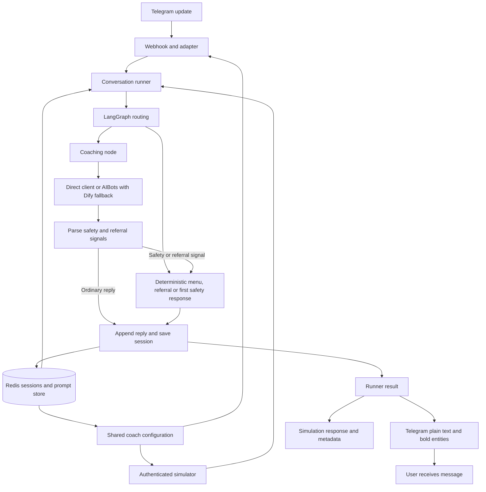
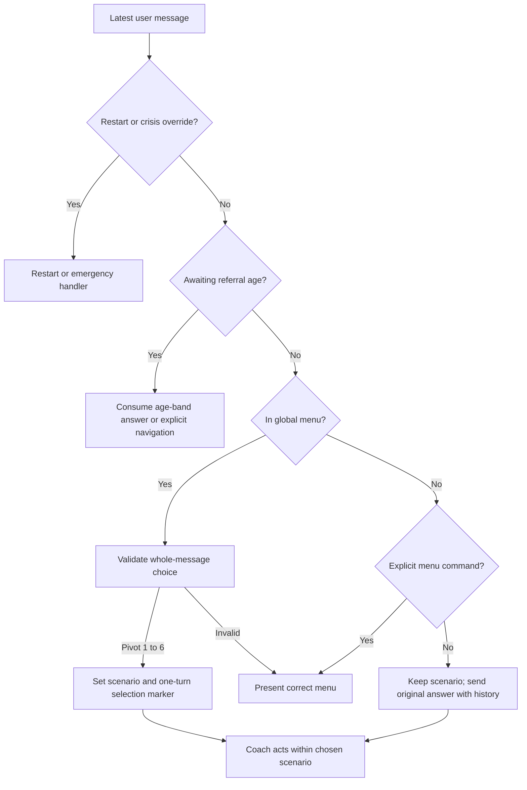
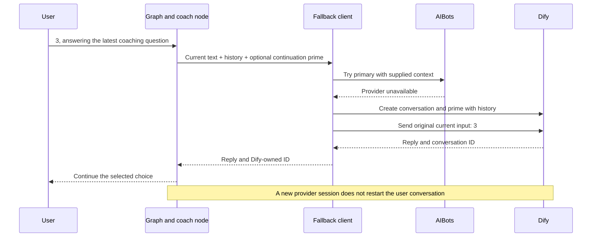
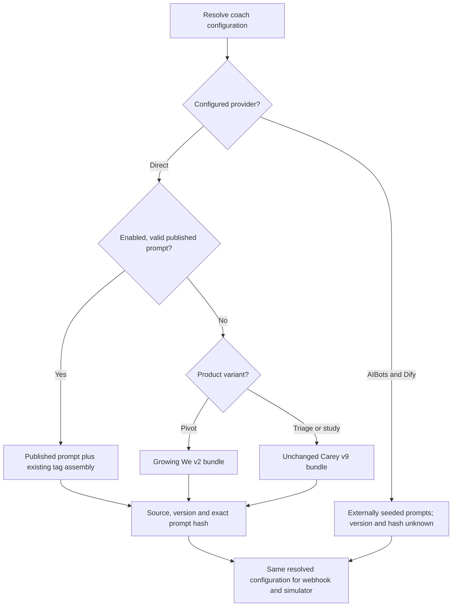

# CareyChats — architecture and implementation

Implemented locally on 13 September 2026, on branch `codex/careychats-comment-fixes`, based on upstream `8bffffc` (including the updated greeting).

Status: implementation and automated checks complete for an authorised branch push and preview deployment check. **Production promotion and live-prompt publication are not part of this release candidate.** Deployment acceptance must be checked against the pushed commit; this document does not certify production configuration. Diagrams are collected at the end.

## 1. What changed and why

The central failure was a routing collision: a user's answer to the coach's numbered question could be treated as a global service selection, change the selected scenario, clear the provider session, and become `Hi` before reaching the model. That chain could explain ignored choices, repeated menus and new introductions from a single underlying bug. Historical screenshots do not establish which provider/prompt/configuration was active.

| Reported symptom | Implemented correction | Evidence |
|---|---|---|
| Numbered choice ignored or wrong topic opened | Interpret global choices only in the menu phase; accept all six pivot scenarios; local digits preserve scenario/session | Full-graph routing tests in both menu modes |
| Ordinary text unexpectedly changes scenario | TALK/SOCIAL no longer map to pivot scenario IDs; HUMAN is a separate referral outcome | Controlled classifier tests |
| Repeated introductions/context questions | Explicit one-turn selection marker; original message retained; recovery instructions do not restart the conversation | Real direct-client request assembly tests |
| Apparent forgetting during a handoff | Preserve history even when a prime is supplied; replay it when creating a provider conversation | Wrapper and real AIBots/Dify request tests with mock transport |
| Conflicting intro/menu behaviour | Separate pivot prompt with platform-owned flow; unchanged study prompt | Prompt-selection tests and study source hash |
| Local test bot differs from live prompt path | Shared effective configuration for webhook and simulator; prompt source/version/hash metadata | Resolver tests and API typecheck |
| Bold appears as asterisks | Limited bold entities in the Telegram adapter, without enabling arbitrary markup | Transport tests including Unicode, literal markup and failure cases |
| Echoing, jargon and forced Singlish | Revised pivot language rules after deterministic fixes | Prompt checks only; generated-output UAT still required |

Two adjacent defects needed correction to make these routes work safely: referral age answers were never consumed, and several nodes entered the crisis phase before the static-first handler could recognise a first crisis turn. The static message text itself was not changed.

## 2. Ownership and boundaries

The transport adapter normalises incoming messages. The runner loads conversation state and appends the original user message. LangGraph owns intake, navigation, referral and crisis transitions. AI clients own only provider communication; the coach generates coaching content within that flow. The session persister appends the assistant reply and saves state before the webhook sends it.

| Component | Responsibility | Must not infer |
|---|---|---|
| Router/classifier | Determine whether this is navigation, a local reply, a referral or safety escalation | A local number is not an unsolicited global selection |
| Coaching node | Select an entry/handoff/recovery instruction and pass history plus the latest raw input | Missing provider ID does not mean new conversation |
| Fallback client | Preserve supplied context across provider transitions | A prime does not mean history is disposable |
| Prompt resolver | Choose the effective direct prompt and record its identity | A local override does not configure externally seeded providers |
| Telegram adapter | Render only supported bold ranges in plain text | Model output is not trusted HTML or general Markdown |

No new dependencies or general-purpose routing/rendering framework were added. Existing graph nodes and injected clients remain the main structure.

## 3. Answer binding and navigation

`conversationPhase` determines the meaning of a number:

- **Menu:** 1–6 select pivot scenarios; 1–3 select legacy triage services. Selection uses the raw whole message, so `1/2` and `-1` cannot become option 1 through punctuation stripping.
- **Active coaching:** a bare numeric reply is passed unchanged to the current coach. The latest question in history supplies its meaning. The deterministic tests prove delivery and state preservation, not that every model always interprets the choice correctly.
- **Pending referral age:** 1/yes and 2/no answer the age-band question. They do not select scenarios. A band is not fabricated into an exact stored age.

In pivot intent mode, natural-language turns still go through safety/referral classification, but TALK and SOCIAL cannot change the selected scenario. HUMAN routes to the deterministic referral node. In numbered mode, the existing coach referral tag remains the human-handoff mechanism. Crisis phrase detection precedes both modes.

`menu`, `back` and the existing navigation synonyms return to the menu; choosing a scenario there deliberately changes topics. Restart clears transient selection, handoff and referral state and reuses the current product's welcome source instead of maintaining a second stale greeting.

Implementation: `src/nodes/router.ts`, `intentClassifierNode.ts`, `menuPresenter.ts`, `resourceRedirectNode.ts`, `restartNode.ts`, and `src/graph/graph.ts`.

## 4. Conversation entry versus provider sessions

`menuSelection?: boolean` is an additive one-turn state marker. The classifier sets it for an explicit initial selection, the graph carries it, and the destination node clears it. Old saved sessions without it are treated as having no explicit new selection. No database migration, backfill or Redis flush is required.

| Entry case | Instruction and context |
|---|---|
| Explicit pivot scenario selection | Scenario-specific prime, known age, relevant history; do not repeat answered questions |
| Legacy service selection | Selected service's entry context |
| Accepted or classified handoff | Existing handoff markers; create the correct provider session and continue the prior context |
| Ordinary continuation | Existing provider ID, history and original input; no opening prime |
| Recovery without a provider ID | Continuation/recovery prime, history and original input; no fresh introduction |

The current user message appears once as the current input, not as `Hi` and not duplicated at the end of history. Direct clients send system instructions, history and current input in order. AIBots/Dify clients prime a newly created server conversation with context, then send the current input; normal existing server conversations do not replay the transcript on every turn.

Backend failure can still fail a request: this change preserves context during supported recovery paths, not exactly-once processing under every network failure. Session expiry still follows the existing six-hour policy.

Implementation: `src/types/state.ts`, `src/nodes/socialCoachNode.ts`, `freeTextNode.ts`, and `src/services/fallbackAIClient.ts`.

## 5. Safety and referral transitions

Nodes signal `crisisDetected`; the emergency handler owns entry into `conversationPhase = crisis`. This preserves static-first behaviour for phrase matches, classifier labels, coach tags, legacy service tags and the study safety check. On the first static response, the old provider ID is cleared because it may belong to another bot; subsequent support uses retained history and the real latest message.

CRISIS takes precedence over REFERRAL. Referral links remain deterministic and based on known age or an explicit age-band answer. After referral, the existing scenario is retained; an initial-menu referral with no scenario returns to menu phase rather than leaving an unroutable state.

The existing safety-copy constant says clinical sign-off is pending. This implementation does not certify the wording, clinical effectiveness, staff response time or production safety. Those remain release/governance requirements.

## 6. Prompt configuration and future editing

`src/services/resolveCoachConfig.ts` is called by both webhook and simulator. The prompt admin also exposes effective metadata and the appropriate bundled text.

| Runtime situation | Effective prompt |
|---|---|
| Direct provider with a valid enabled published prompt | Published prompt from the existing store |
| Direct pivot without a usable published prompt | `src/config/growingWeCoachPrompt.ts`, version `growing-we-v2` |
| Direct triage/study defaults | Existing `src/config/socialCoachPrompt.ts`, unchanged |
| AIBots with Dify fallback | Externally seeded prompts; local overrides are not applied |

Metadata includes product variant, configured provider/model, source, version, exact SHA-256 prompt hash when locally known, and deployment commit SHA when available. The webhook records configuration metadata, UAT records carry it, and the authenticated simulator returns it. External prompt hashes/versions are explicitly unknown, not invented. Actual AIBots/Dify/direct session ownership remains separately available from the chat ID.

To update the coach:

1. Check the effective source. A published prompt can override the bundle even after a new code deployment.
2. For the bundled pivot, edit `src/config/growingWeCoachPrompt.ts`, update its version, review safety tags and run the checks below.
3. For an admin-published prompt, review and test the proposed text before an authorised publication. No prompt was published during this implementation.
4. For externally seeded providers, coordinate that provider's separate prompt update; this repository cannot verify an unseen seeded prompt.

For the platform introduction, edit the appropriate welcome in `src/config/questionnaire.ts` (pivot) or `src/nodes/ageCheckNode.ts` (triage). Restart now uses the same welcome path. Changing an intro does not require the AI to introduce itself again.

`SYS_PROMPT.md` retains historical design text and now identifies the runtime source. **Do not use `npm run gen:prompt` to update the coach**: that legacy generator writes the general bot's `careySystemPrompt.ts`. The study prompt source is protected by a byte-for-byte regression check in this change.

## 7. Telegram formatting contract

Balanced standalone `*bold*` and `**bold**` become plain text plus bold entity ranges. Other content stays text. This intentionally supports neither arbitrary HTML nor a full Markdown dialect. Unmatched/unsupported markers, literal arithmetic and URL path characters are preserved conservatively.

Offsets use JavaScript string lengths, matching Telegram's UTF-16 entity offsets. See the [official MessageEntity contract](https://core.telegram.org/bots/api#messageentity). No `parse_mode` is enabled, so HTML-looking text is not interpreted as HTML.

Only an explicit HTTP 400 entity-parse rejection permits one plain-text fallback. Ambiguous network failures, authentication failures, rate limits and unrelated API errors are not retried by this formatter. Message splitting and general delivery retries are outside this change.

## 8. Verification and outstanding release checks

Run from the repository root:

```sh
npm run build
npm run typecheck:api
npm run test:comments -- --silent
npm test -- --runInBand
git diff --check
```

Local evidence:

- Initial synthetic full-graph reproduction: 27 failed and 10 passed before the fixes.
- Application build and API-inclusive typecheck pass.
- The comments regression command passes **239 tests across 17 suites**, covering routing, entry, providers, prompts, formatting, restart, study flags and safety handlers.
- A clean temporary archive of upstream `8bffffc` had 28 passing / 11 failing suites, with 310 passing / 10 failing executed tests. The earlier checkout's baseline differed because the newer upstream greeting invalidated two additional old copy assertions.
- Final full suite: **33 passing / 10 failing suites; 403 passing / 9 failing executed tests**. Comparison with the clean upstream archive found no new failing assertions; the corrected restart test became green. Existing failures remain visible, not skipped or waived.

Remaining existing failures: six suites reference removed/renamed APIs or questionnaire exports; session-manager tests lack encryption configuration; whitelist tests expect an obsolete TTL; age-copy tests expect the previous greeting/Yes-No intake. This change does not rewrite unrelated tests just to produce a green dashboard.

All new behavioural tests use synthetic messages and mocked services. Tests exercise real graph/node logic and real client request construction where specified; they do not send production conversations to AI services.

Before release:

- Verify the actual deployment SHA, flags, provider/model and effective prompt source/hash. No local Vercel project link was available, and live configuration was not verified.
- Run at least three fresh synthetic conversations per scenario against the selected live model/prompt in an authorised preview environment. Review lost selections, repeated intros, already-answered questions, echoing, plain language and Singlish. Prompt-string tests cannot establish generation quality.
- Check bold, URLs and fallback presentation in a test Telegram chat; smoke-test the study endpoint and human/crisis handoffs.
- Resolve or explicitly review existing test failures and security/governance blockers before approving production use.
- Branch push and preview deployment verification were authorised on 13 September 2026. The repository credential was verified as `carecorner-insight`, with push access and matching configured commit identity. Check Vercel acceptance against the pushed commit; production promotion and live-prompt publication require separate approval.

## 9. Security review and rollback

The changed input boundaries, routing, prompt metadata and Telegram output were reviewed. The formatter emits only bold entities, new metadata excludes prompt bodies/credentials/user content, and existing simulator/admin token gates remain in place. No new endpoint, dependency, credential or externally supplied URL sink was introduced. Synthetic test keys are not production secrets.

Pre-existing release risks remain:

- **High — webhook authenticity:** `api/webhook.ts` accepts POST payloads without platform-secret/signature verification. A forged update can impersonate an in-scope user and drive conversation state/outbound replies. Add platform-specific verification before accepting/acknowledging updates in separate security work.
- **Medium — diagnostic privacy:** `src/graph/runner.ts` logs raw incoming message text. Sensitive content can enter deployment logs. Remove/redact that logging under a reviewed retention policy; the new configuration metadata does not add user-message logging.
- **Reliability — lock/delivery lifecycle:** the existing short lock, acknowledgement and persistence-before-delivery behaviour are not an exactly-once delivery system. They remain separate from the answer-binding fixes.

Rollback code and any subsequently published prompt independently but as a coordinated release. Restoring an older deployment alone does not restore a Redis-published prompt. Preserve sessions; the optional selection marker is additive and old code ignores unknown JSON fields. No session reset or data deletion is required for this implementation. The release-candidate changes are isolated on `codex/careychats-comment-fixes`; the branch push does not merge them into `main`.

## 10. Diagrams

### Runtime architecture



### How a number gets its meaning



### Provider recovery preserves the answer



### Effective prompt selection


