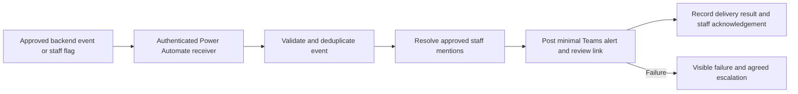

# Power Automate → Teams alerts: setup handoff

Status: Power Automate was selected by the project owner. No flow has been created,
edited or activated in Microsoft 365, and no Teams message has been sent. The team,
channel, recipients, trigger and existing flow connection are not yet supplied.
This is a setup guide, not a deployed alerting system.
Maintenance-mode notes below require the Bot Control release and its dedicated
admin password setup; see section 10 of `docs/ARCHITECTURE_IMPLEMENTATION.md`.
The session-ID change alone does not enable maintenance mode.

## Decisions needed before connecting

1. Team/channel and whether it is standard, shared or private; verify the selected
   Teams action supports that channel type in the tenant.
2. Named staff to @mention and approved channel membership for sensitive alerts.
3. Trigger: automatic crisis detection, a staff member manually flagging a turn,
   or both. These are different entry points; no manual Flag button exists yet.
4. Flow owner plus a co-owner, an escalation owner, and who handles failures.
5. An approved review-page destination and retention/acknowledgement policy.

## Current repository integration

`src/services/sharePointLogger.ts` posts to the server-side
`POWER_AUTOMATE_WEBHOOK_URL`. Its payload already contains `platform`, `userId`,
`username`, `conversationId`, optional `sessionId`, `tag`, `crisisDetected`, `conversationPhase`,
`questionIndex`, `answers`, `aiProvider`, `userMessage`, `aiResponse`, and `timestamp`.
The schema in `docs/power-automate-log.schema.json` describes the existing payload;
do not paste the entire payload into Teams just because the receiver has it.

### Session grouping: Telegram social-coach log flow

The backend generates a random UUID v4 `sessionId`, carries it through the graph,
and saves it with the encrypted session. Every logged turn in that saved session
shares the ID. `conversationId` remains the transport's ID (normally empty for
Telegram); `aiBotChatId` remains the provider's ID. Neither is replaced.

- A fresh session, explicit restart, or message after session expiry gets a new ID.
  Restart's log entry belongs to the new ID. Expiry is six hours of inactivity:
  every successful session save refreshes the existing TTL.
- Menu/scenario changes and AI-provider session changes keep the ID. Existing
  saved sessions without a valid ID receive one on their next processed turn,
  without losing their history. No Redis flush or database migration is needed.
- Error-path logs may omit the ID if no session was successfully saved yet.
  Unauthorized turns are not saved, so they are not a persistent session.
  Maintenance mode does not enter the graph or create/save a session ID.
- IDs group log rows; they are not authentication tokens, message IDs, or crisis
  episode IDs. Do not deduplicate alerts by session ID: one session may contain
  multiple independent incidents. This change does not add delivery guarantees.

To store it in the existing Power Automate flow:

1. Add `"sessionId": { "type": "string" }` to the HTTP trigger schema's
   `properties`. Leave it out of `required` so older/error-path payloads still
   work. `docs/power-automate-social-coach-log.schema.json` is the complete
   Telegram social-coach version, with `tag` retained and platform/screener-only
   fields omitted. The backend can still send extra fields; the schema permits
   them. This schema is not a filter separating main and study traffic.
2. Add a SharePoint **SessionId** column of type **Single line of text**. Allow
   blanks and do **not** enforce unique values: many rows share each session ID.
3. In the existing **Create item** action, map SessionId to the trigger's
   `sessionId` dynamic value, or use `coalesce(triggerBody()?['sessionId'], '')`.
   Do not call `guid()` in the flow; it would generate a different ID per run.
4. Save the flow and deploy the backend change through the normal release path.
   Using synthetic test data, confirm two turns share an ID and restart produces
   a different ID. No new webhook URL or Teams channel is required.

An existing flow that allows additional properties can continue running without
this mapping, but it will not store the new field. Existing rows remain blank;
session boundaries cannot reliably be reconstructed from their empty Telegram
conversation IDs. Keep the study bot's existing separate receiver/list; the shared
logger may also emit this optional field there, but its mapping need not change.
Repository changes alone do not update the live flow or deploy the backend.

Important limitations before reusing this as an alert channel:

- The logger does not check HTTP success and has no timeout. It is not verified
  reliable delivery. Harden this path or add a dedicated alert sender after the
  selected trigger and authentication are known.
- `crisisDetected` remains true on follow-up turns. An alert on every true value
  would notify repeatedly. Telegram conversationId can be empty, so it is not a
  safe unique deduplication key by itself.
- Before automatic production alerts, introduce a stable alert-event/crisis-episode
  ID, durable deduplication, bounded retries and failure reporting. Do not use an
  indefinitely deduplicated userId: that would hide a later independent incident.
- Current webhook authenticity checks are a known outstanding security issue.
  Do not treat a forged webhook event as authenticated evidence about a person.
- Maintenance mode does not enter the conversation graph or detect new crises.
  It sends only its fixed notice; no new crisis alert is generated while OFF.
- Preview settings isolation is not credential isolation. Use a separate test flow,
  test channel, and test-bot credentials for UAT; never reuse production recipients.

## Recommended flow structure (after the decisions above)

1. Reuse the existing authenticated HTTP receiver if its ownership and contract
   are confirmed, or create a separate authenticated HTTP-triggered flow. Restrict
   the trigger to the intended tenant/service identity. The backend must supply
   the authentication that trigger requires; merely knowing an OAuth-protected
   URL does not authenticate a request. Keep URLs and credentials server-side.
2. Validate the JSON payload. For automatic events, check the explicit boolean
   crisisDetected, not a guessed interpretation of tag or prose. For manual
   flags, require the staff-control endpoint and a validated stored turn reference.
3. Claim the stable event ID in durable storage. Handle concurrent/retried flow
   runs without posting twice, while retaining failed events for recovery.
4. Use **Get an @mention token for a user** for each approved recipient. Include
   the generated dynamic tokens in **Post a message in a chat or channel**.
   Configure the team/channel in the flow, not from arbitrary incoming JSON.
5. Post minimal operational information: event ID, event type, time, environment
   and a protected review link. Do not post the full transcript, raw model output,
   phone numbers, or names from conversation text to a broad channel. Avoid raw
   user HTML and never place an access token in the review URL.
6. Record the Teams message ID and posting outcome. Handle failure/timeouts and
   alert the operational owner through an agreed independent path. An HTTP 202
   from the trigger is acceptance, not proof that Teams received the message.
7. Use an explicit acknowledgement/escalation process if this is operationally
   urgent. An @mention alone does not prove somebody read or acted on the alert.

The standard Post a message in a chat or channel action cannot set Teams'
Important/Urgent flag. A clear alert heading plus proper @mentions is different
from that product flag. Check channel support before choosing the action.

## Synthetic acceptance tests

- Ordinary turn → no alert. A single approved trigger → one correctly routed alert.
- The same event retried/concurrent → one alert, not one per HTTP attempt.
- A later independent episode → a new alert.
- Missing/wrong authentication or malformed payload → rejected, no Teams post.
- Teams 403/429/timeout → visible failure/retry state, never a false delivered mark.
- Mention targets see real mentions, and only approved staff can open the review.
- OFF → maintenance notice, no AI, no new automatic crisis event.
- Preview event → test destination only; production and study recipients unchanged.

No real conversations or notifications should be used for these tests until
the data recipients and test destination are explicitly approved.

## Official references

- [Posting and individual mentions](https://learn.microsoft.com/en-us/power-automate/teams/send-a-message-in-teams)
- [HTTP trigger authentication](https://learn.microsoft.com/en-us/power-automate/oauth-authentication)
- [SharePoint connector: Create item and column mappings](https://learn.microsoft.com/en-us/connectors/sharepoint/)
- [Teams workflows and ownership](https://learn.microsoft.com/en-us/microsoftteams/platform/webhooks-and-connectors/how-to/add-incoming-webhook)

## Intended routing

